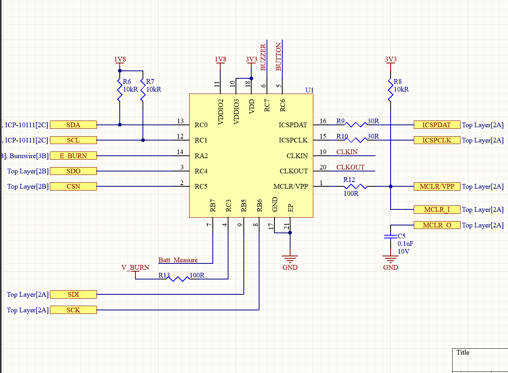

# Functionality
The core functionality of the NUTS flight computer is measuring the required sensor values (CO2 contents, acceleration, temperature etc.), deploying the autogyro at an altitude of 200m during descent, and transmitting the acquired sensor values to the groundstation.

# Hardware
## PIC18F16Q20 Microcontroller

## ICP-10111 Barometer

## ICM-20948 Inertial Measurement Unit

## ENS160 Gas sensor

## NRF24L01+ 2.4Ghz tranceiver

# Schematics
The schematic below indicates all of the connections from the PIC18F16Q20 to its peripherals. 
 - PIC pin 1 → MCLR pin, used for in circuit serial programming (ICSP)
 - PIC pin 2 → CSN pin, chip select pin for SPI communications. Connected to the NRF24L01+ 
 - PIC pin 3 → SDO pin, slave data out pin for SPI communications. Connected to the NRF24L01+
 - PIC pin 4 → V_burn pin, which is connected to the burnwire. Used for sensing the voltage accross the burnwire. Since this voltage is well below 3.3 volt, no voltage divider is required. Current limiting resistor placed in series.
 - PIC pin 5 → BUTTON pin is connected to the configuration button. Pull-up in connected in parallel.
 - PIC pin 6 → BUZZER pin is connected to the buzzer. Writing it high activates the buzzer.
 - PIC pin 7 → BATT_measure pin is connect to the 9v battery source via a voltage divider. Used for sensing the battery voltage.
 - PIC pin 8 → SCK pin, clock pin for the SPI communication. Connected to the NRF24L01+
 - PIC pin 9 → SDI pin, slave data in pin for SPI communication. Connected to the NRF24L01+
 - PIC pin 10 → VDDIO3, power source for the MCU. Connected to 3.3v
 - PIC pin 11 → VDDIO2, power source for the MCU. Connected to 1.8v as this connects to the 1.8v I2C bus. Decided as one of the sensors does not tolerate 3.3v.
 - PIC pin 12 → SCL pin, clock pin for the I2C communication. Connected to the I2C bus to which all the sensors are connected.
 - PIC pin 13 → SDA pin, data pin for the I2C communication. Connected to the I2C bus to which all the sensors are connected.
 - PIC pin 14 → E_burn pin is connected to the burnwire chip. Writing this pin high activates the burnwire.
 - PIC pin 15 → ICSPCLK pin, used for in circuit serial programming (ICSP)
 - PIC pin 16 → ICSPDAT pin, used for in circuit serial programming (ICSP)
 - PIC pin 17 → GND pin.
 - PIC pin 18 → VDD, power source for the MCU. Connected to 3.3v
 - PIC pin 19 → CLKIN, pin for connecting an external oscillator
 - PIC pin 20 → CLKOUT, pin for connecting an external oscillator

# Improvements
 - As of yet, not a lot of research has been put into clock speeds and the effect on the microcontroller. The main benefit of increasing the clock speed is the increase in telemetry sending rate. We have currently chosen a conservative clock speed to ensure MCU stability. An MCU crash at burnwire deployment could majorly influence the functioning of our satellite.