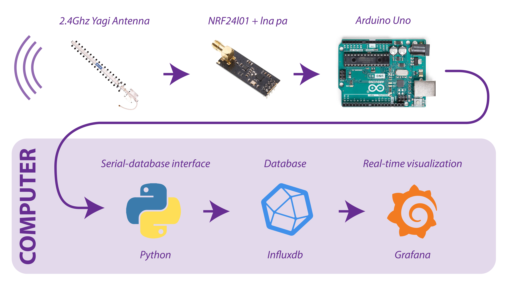

# Mulerius Satellites Software 2025
This is the github repository associated with Mulerius Satellites team '25. The repository is separated in the three different pieces of hardware required for the mission. These are: NUTS (Cansat’s flight computer), the USBANT (the antenna to usb interface) and the COMPUTER (telemetry databasing and dashboarding). README’s and code are provided in the associated subfolder.

## Interfaces
The following interfaces are present in the complete system. The NUTS pcb measures environmental variables, which are communicated to the USBANT over RF. The USBANT relays the received data to the computer which shows the information on dashboards. The details of these interfaces are highlighted in this readme, as they transcend the readme’s from the subsoftwares.

### COMPUTER ↔ USBANT
The main interface between computer and USBANT is the serial connection. In order to assure proper functionality, make sure that the baud rates, bit parity and other serial settings align. They can be found and set up in `COMPUTER/dependencies/python/usb_influxdb_interface.py` (Computer) and `USBANT/NRF_receiver/NRF_receiver.ino` (USBANT). In the current setup, the baud rate is set to 119200 baud and the other serial settings are left at Arduino’s default. These are 8 data bits, no parity and one stop bit.

### USBANT ↔ NUTS
The interface between USBANT and the NUTS happens between the two NRF24L01+ 2.4Ghz tranceivers. The NUTS tranceiver is set up as a transmitter, whereas the USBANT is set up as a receiver. This requires that both devices are set up in accordance with each other. The current setup is as follows:
 - The payload size is set to 32 bytes.
 - CRC is enabled and set to a single byte.
 - The data rate is set to 250kbps
 - Retransmission of unreceived packets is disabled.
 - The power level is set to its maximum.
 - Auto acknowledgement is disabled.
 - Address size is set to 3 bits.
 - Channel is set to 0x28 to align with the optimal frequency of 2440 Mhz of the antennas.

Setting up this configuration requires a lot of attention as the smallest misconfiguration may destroy the complete system.
